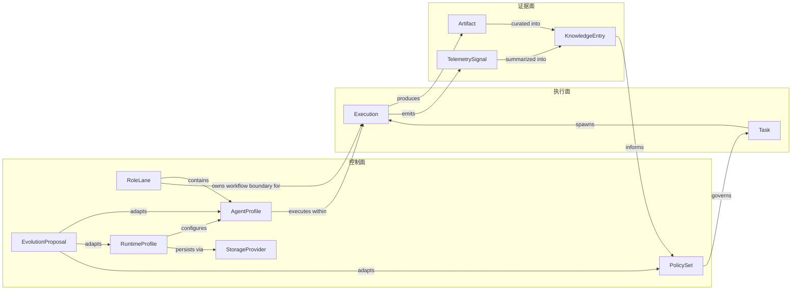

# moss-harness 轻量本体草图 v3

> 本文档基于 `agent-harness-spec` 当前仓库结构，沉淀一套轻量、稳定、可落地的语义骨架，用于统一 `configs/`、`runtime/`、`apps/mosscli/`、`apps/mossclaw/` 与 `observability/` 的领域命名与边界。

## 文档定位

这份 `v3` 不是一个新的元系统，也不是额外的配置平台。

它的目标只有一个：为 `moss-harness` 提供一层统一语义真源，使系统的控制面、执行面、证据面能够在同一套命名体系下协同演进，而不是在不同模块内不断漂移出平行概念。

本文档直接对齐当前仓库中的既有架构事实：

- 四层架构与核心不变量
- `Role Lane ownership`
- `Fact -> Audit -> Broadcast`
- `Read-only Web observability`
- `members` 作为 Agent 成员唯一真源
- 任务路由、阶段推进、记忆分层、存储抽象与受控演化

## 设计目标

轻量本体需要同时满足以下目标：

- 统一核心对象命名，减少跨模块双重语义
- 保留当前 SCI 闭环架构，不引入额外平台复杂度
- 支持后续设置中心、控制台、运行时、观测面共同收敛
- 让 `Task`、`Execution`、`Artifact`、`KnowledgeEntry`、`TelemetrySignal` 形成可解释的事实链
- 让 `RoleLane`、`AgentProfile`、`PolicySet`、`RuntimeProfile`、`StorageProvider`、`EvolutionProposal` 形成稳定控制面

## 正式命名

本体一级对象采用以下 11 个正式命名：

- `RoleLane`
- `AgentProfile`
- `Task`
- `Execution`
- `Artifact`
- `KnowledgeEntry`
- `RuntimeProfile`
- `TelemetrySignal`
- `PolicySet`
- `StorageProvider`
- `EvolutionProposal`

## 本体原则

### 一、控制面、执行面、证据面分离

- 控制面负责声明边界、能力、配置、策略与演化治理
- 执行面负责表达系统收到什么工作，以及某次运行实际发生了什么
- 证据面负责留下结构化产物、知识沉淀与观测信号

### 二、Task 与 Execution 分离

- `Task` 表达“要做什么”
- `Execution` 表达“做了一次什么”
- `Task` 不承载阶段机、重试数、返工数等运行态细节
- `Execution` 不替代 Task 的业务意图语义

### 三、RoleLane 与 AgentProfile 分离

- `RoleLane` 是稳定职责泳道，不是实例
- `AgentProfile` 是可被注册、路由、启停、评估的成员画像
- 先有泳道，后有成员；成员必须归属某条泳道

### 四、RuntimeProfile 与 StorageProvider 分离

- `RuntimeProfile` 是配置语义对象
- `StorageProvider` 是底层持久化实现
- 配置不应直接等价于数据库、文件或连接串细节

### 五、证据优先于叙述

- `Artifact`、`KnowledgeEntry`、`TelemetrySignal` 共同构成系统证据链
- 事实优先于叙述，回放优先于猜测
- 观测面只能描述系统，不应偷偷变成第二控制面

### 六、演化必须受控

- 所有系统演化动作都应通过 `EvolutionProposal`
- 演化必须先验证、可回滚、可审计
- 提议者不能同时定义成功标准并自行批准变更

## 三平面视图

- 控制面
  - `RoleLane`
  - `AgentProfile`
  - `RuntimeProfile`
  - `PolicySet`
  - `StorageProvider`
  - `EvolutionProposal`
- 执行面
  - `Task`
  - `Execution`
- 证据面
  - `Artifact`
  - `KnowledgeEntry`
  - `TelemetrySignal`

## 核心对象清单

| 对象 | 平面 | 定义 | 主要事实来源 | 建议主键 |
| --- | --- | --- | --- | --- |
| `RoleLane` | 控制面 | 稳定职责泳道，定义责任边界、输入输出工件、claim 与 selection 规则 | `configs/orchestration/agent-registry.yaml` 中的 `lanes` | `roleLaneId` |
| `AgentProfile` | 控制面 | 某泳道下可被注册、路由、启停、评估的 Agent 画像 | `configs/orchestration/agent-registry.yaml` 中的 `members`，以及 `apps/mossclaw` 的 Agent 领域模型 | `agentProfileId` |
| `Task` | 执行面 | 被系统接收、分类、治理和关闭的工作单元 | `runtime/orchestration/` 的任务输入与路由判定 | `taskId` |
| `Execution` | 执行面 | 某个 Task 的一次可跟踪、可重放的运行实例 | `apps/mosscli` 的阶段推进与运行状态 | `executionId` |
| `Artifact` | 证据面 | 执行或阶段产出的结构化结果物 | `input_artifacts` / `output_artifacts` 规范与运行时产物目录 | `artifactId` |
| `KnowledgeEntry` | 证据面 | 被沉淀、检索、注入、裁剪和复用的知识条目 | `runtime/memory/` 的分层记忆系统 | `knowledgeEntryId` |
| `RuntimeProfile` | 控制面 | 某对象或某子系统的有效运行配置语义对象 | `configs/`、模型配置读取逻辑、运行时有效态 | `runtimeProfileId` |
| `TelemetrySignal` | 证据面 | event、metric、audit、timeline 等观测信号 | `runtime/telemetry/` 与 `observability/` | `telemetrySignalId` |
| `PolicySet` | 控制面 | 对输入进行评估并输出 route 或 decision 的规则集合 | `runtime/orchestration/` 中的路由与治理策略 | `policySetId` |
| `StorageProvider` | 控制面 | 提供持久化能力的可替换基础设施实现 | `runtime/storage/` 的抽象与实现 | `storageProviderId` |
| `EvolutionProposal` | 控制面 | 针对 Agent、Policy、Profile 等对象的受控变更提案 | `runtime/evolution/` 与演化治理文档 | `evolutionProposalId` |

## 对象定义

### RoleLane

含义：

- 系统中的稳定职责泳道

关键字段：

- `roleLaneId`
- `name`
- `description`
- `required`
- `inputArtifactTypes`
- `outputArtifactTypes`
- `claimPolicy`
- `selectionPolicy`

建议枚举：

- `core`
- `auxiliary`

### AgentProfile

含义：

- 泳道中的可选成员画像

关键字段：

- `agentProfileId`
- `roleLaneId`
- `mode`
- `status`
- `capabilities`
- `domainTags`
- `configRef`
- `version`

建议枚举：

- `mode=backup|expert`
- `status=active|candidate|deprecated|inactive`

### Task

含义：

- 系统要处理的工作请求

关键字段：

- `taskId`
- `kind`
- `title`
- `description`
- `source`
- `tags`
- `priority`
- `status`

建议枚举：

- `kind=task|learning`

### Execution

含义：

- 某个 `Task` 的一次具体运行

关键字段：

- `executionId`
- `taskId`
- `route`
- `currentRoleLaneId`
- `currentStage`
- `status`
- `retryCount`
- `reworkCount`
- `startedAt`
- `completedAt`

### Artifact

含义：

- 阶段结果、计划、反馈、实现、测试结果等结构化产物

关键字段：

- `artifactId`
- `executionId`
- `taskId`
- `type`
- `producerType`
- `producerId`
- `stage`
- `uri`
- `version`

### KnowledgeEntry

含义：

- 可被记忆系统长期消费的知识条目

关键字段：

- `knowledgeEntryId`
- `layer`
- `type`
- `content`
- `confidence`
- `tags`
- `sourceExecutionId`
- `expiresAt`

建议层次：

- `curated`
- `dynamic`
- `retrieval`

### RuntimeProfile

含义：

- 某对象的有效运行配置

关键字段：

- `runtimeProfileId`
- `scopeType`
- `scopeId`
- `profileType`
- `source`
- `effectiveConfig`
- `version`
- `updatedAt`

### TelemetrySignal

含义：

- 执行过程中产生的观测证据

关键字段：

- `telemetrySignalId`
- `executionId`
- `taskId`
- `kind`
- `name`
- `timestamp`
- `payload`
- `source`

建议枚举：

- `event`
- `metric`
- `audit`
- `timeline`

### PolicySet

含义：

- 规则集合

关键字段：

- `policySetId`
- `name`
- `policyType`
- `inputSchema`
- `decisionSchema`
- `version`
- `status`

建议枚举：

- `routing`
- `governance`
- `learning`

### StorageProvider

含义：

- 持久化提供者

关键字段：

- `storageProviderId`
- `backend`
- `connection`
- `pool`
- `migration`
- `healthStatus`

建议枚举：

- `sqlite`
- `postgresql`
- `file`
- `memory`

### EvolutionProposal

含义：

- 系统演化提案

关键字段：

- `evolutionProposalId`
- `subjectType`
- `subjectId`
- `changeType`
- `proposedBy`
- `validationMode`
- `status`
- `rollbackTrigger`

## 关系图

## 动作约束表

| 对象 | 核心动作 | 不变量 |
| --- | --- | --- |
| `RoleLane` | `define()` `selectAgentProfile()` `enforceBoundary()` | 先有泳道再有成员；泳道只定义职责边界，不直接保存运行态 |
| `AgentProfile` | `register()` `activate()` `deprecate()` `claimTask()` `reportResult()` | 必须归属唯一主泳道；expert 优先但必须保留 backup fallback；配置与运行态分离 |
| `Task` | `intake()` `classify()` `prioritize()` `close()` | 只表达工作意图，不混入 retry、stage、rework 等执行内部状态 |
| `Execution` | `start()` `advance()` `retry()` `rework()` `complete()` `fail()` | 表达某次运行；必须可 replay；遵守 `Fact -> Audit -> Broadcast` |
| `Artifact` | `emit()` `attach()` `version()` `archive()` | 必须明确 `producer`、`stage`、`type`；不能由 UI 隐式篡改语义 |
| `KnowledgeEntry` | `addCurated()` `addDynamic()` `retrieve()` `prune()` `inject()` | 必须保留分层；fact-like 条目受 confidence 阈值控制；注入受 token budget 约束 |
| `RuntimeProfile` | `resolve()` `materialize()` `sync()` `persist()` | 配置只有单一真源；模板、持久态、有效态分离；运行时副本不得污染模板 |
| `TelemetrySignal` | `record()` `aggregate()` `trace()` `report()` | 只描述状态，不写控制状态；必须关联 execution、task 与 source |
| `PolicySet` | `evaluate()` `selectRoute()` `emitDecision()` | 只输出决策；不直接更新业务表；输入输出必须结构化且可解释 |
| `StorageProvider` | `initialize()` `transaction()` `query()` `migrate()` `health()` | 是基础设施对象，不反向污染领域命名 |
| `EvolutionProposal` | `propose()` `shadowValidate()` `promote()` `rollback()` | 先评估再生效；提议者不能单独裁决；必须具备 rollback 触发条件 |

## 现有模块落点建议

### configs/

主要落点：

- `RoleLane`
- `AgentProfile`
- `RuntimeProfile`
- `PolicySet`

建议：

- 将 `configs/orchestration/agent-registry.yaml` 中的 `lanes` 与 `members` 视为 `RoleLane` 与 `AgentProfile` 的一级真源
- 将模型、约束、技能注册表统一纳入 `RuntimeProfile` 与 `PolicySet` 语义
- 保留兼容视图，但避免新功能继续向旧词汇回流

### runtime/orchestration/

主要落点：

- `Task`
- `Execution`
- `PolicySet`

建议：

- 这里专注 `Task -> Decision -> Route -> Execution`
- `PolicySet` 负责评估与输出决策
- `Execution` 负责承接实际运行与阶段推进

### runtime/memory/

主要落点：

- `KnowledgeEntry`

建议：

- 保留 `curated/dynamic/retrieval` 三层机制
- 在文档、DTO、UI 语义上逐步从 `MemoryEntry` 收敛到 `KnowledgeEntry`

### runtime/storage/

主要落点：

- `StorageProvider`

建议：

- `StorageBackend` 可以作为内部实现枚举暂时保留
- 对外抽象、文档和领域接口统一使用 `StorageProvider`

### runtime/telemetry/ 与 observability/

主要落点：

- `TelemetrySignal`

建议：

- 统一 `event`、`metric`、`audit`、`timeline` 命名
- 让观测层只负责证据输出，不承担控制面写入

### runtime/evolution/

主要落点：

- `EvolutionProposal`

建议：

- 将 candidate、promotion、rollback 等变化都归入同一演化提案语义流
- 避免并行创造 `change request`、`upgrade plan` 等新词

### apps/mosscli/

主要落点：

- `Execution`
- `Artifact`
- `TelemetrySignal`

建议：

- 阶段推进专注于 `Execution`
- 计划、反馈、实现、评估结果等统一表达为 `Artifact`
- trace、timeline、metrics 等统一表达为 `TelemetrySignal`

### apps/mossclaw/

主要落点：

- 控制台投影层

建议：

- `Agent` 逐步向 `AgentProfile` 收敛
- `Task` 与 `Execution` 应拆分成两个独立资源视图
- 模型与系统配置应统一投影到 `RuntimeProfile`
- 避免让 UI 资源名继续固化旧语义

## 字段命名规则

### 主键统一

- `roleLaneId`
- `agentProfileId`
- `taskId`
- `executionId`
- `artifactId`
- `knowledgeEntryId`
- `runtimeProfileId`
- `telemetrySignalId`
- `policySetId`
- `storageProviderId`
- `evolutionProposalId`

### 关系字段统一

- `parentTaskId`
- `sourceExecutionId`
- `producerId`
- `roleLaneRef`
- `runtimeProfileRef`
- `policySetRef`

### 状态字段统一

- `status`
- `mode`
- `kind`
- `phase`
- `source`

### 时间字段统一

- `createdAt`
- `updatedAt`
- `startedAt`
- `completedAt`

## 禁止混用

### Task 与 Execution

- `Task` 不承载阶段机、重试数、返工数
- `Execution` 不替代任务业务意图

### RoleLane 与 AgentProfile

- `RoleLane` 是职责边界
- `AgentProfile` 是成员画像

### RuntimeProfile 与 StorageProvider

- `RuntimeProfile` 是配置语义
- `StorageProvider` 是实现承载

### KnowledgeEntry 与 TelemetrySignal

- `KnowledgeEntry` 是可复用知识
- `TelemetrySignal` 是原始或聚合观测证据

### PolicySet 与 RuntimeProfile

- `PolicySet` 表达决策逻辑
- `RuntimeProfile` 表达有效配置

## 旧名迁移映射

| 现有概念 | v3 正式名 | 迁移策略 |
| --- | --- | --- |
| `RoleLane` | `RoleLane` | 保持不变，直接升格为一级语义 |
| `AgentMember` / `Agent` | `AgentProfile` | 控制台与 DTO 优先统一 |
| `WorkItem` | `Task` | orchestration 先做术语替换 |
| `RunSession` / `run` | `Execution` | 对外 API 和文档优先统一 |
| `Artifact` | `Artifact` | 保持不变 |
| `MemoryEntry` | `KnowledgeEntry` | 文档、DTO、UI 名称先改，底层表结构后移 |
| `ConfigAsset` / 模型配置对象 | `RuntimeProfile` | 设置中心先落地 |
| `Signal` / `TelemetrySignal` | `TelemetrySignal` | 观测层统一命名 |
| `PolicyPack` | `PolicySet` | 路由和治理规则统一 |
| `StorageBackend` | `StorageProvider` | 外部抽象升级，内部实现兼容 |
| `EvolutionRecord` / `EvolutionProposal` | `EvolutionProposal` | 演化流程统一入口 |

## 推荐落地顺序

### 第一步：文档先行

- 在设计文档、ADR、spec、README 衍生文档中统一 11 个一级对象名

### 第二步：共享类型先行

- 在共享类型层建立 `v3` 命名
- 通过 type alias 或 mapper 提供渐进兼容

### 第三步：API 资源收敛

- 将 `Task` 与 `Execution` 分离建模
- 将 `Agent` 逐步收敛到 `AgentProfile`
- 将配置中心统一收敛到 `RuntimeProfile`

### 第四步：实现层兼容迁移

- 逐步替换 DTO、Repository、Service 与 UI 标签中的旧语义
- 避免一次性大规模硬切

### 第五步：最后处理物理结构

- 在语义稳定后，再评估是否迁移表名、目录名、运行时文件名

## 定稿结论

这版 `v3` 形成了一套稳定、可扩展且与当前仓库兼容的轻量本体：

- 控制面：`RoleLane` `AgentProfile` `RuntimeProfile` `PolicySet` `StorageProvider` `EvolutionProposal`
- 执行面：`Task` `Execution`
- 证据面：`Artifact` `KnowledgeEntry` `TelemetrySignal`

其中最关键的三条边界是：

- `Task != Execution`
- `RoleLane != AgentProfile`
- `RuntimeProfile != StorageProvider`

这三条边界一旦稳住，后续控制台、设置中心、编排层、记忆层、观测层与演化治理就有机会共享同一套语义真源，而不是继续在实现细节中分叉。
